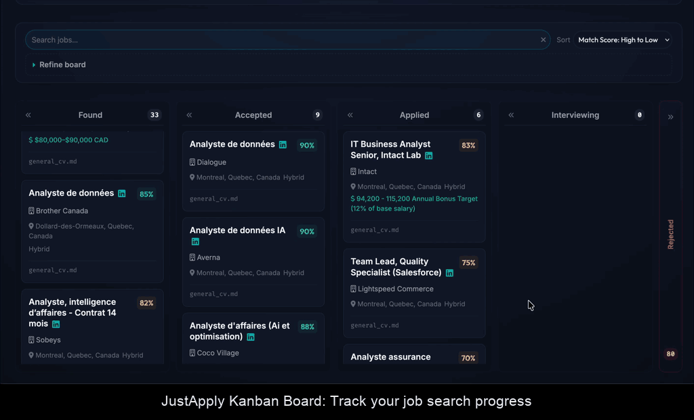

# JustApply 🚀

### Overview
JustApply is an AI-powered job search and application pipeline that automates the "manual" parts of hunting for roles. It scrapes LinkedIn job listings, scores them against your resume using Gemini, and enriches leads with recruiter contacts. Stop wasting time on low-match roles and start applying where it counts.

### Details
- **AI Automated Scraping + Match Scoring**: Automatically evaluate job descriptions against your experience to generate a match score and summary. 
  
- **Smart Enrichment + Outreach & Cache**: Finds hiring managers and recruiters using Apify, featuring specialized filters for HR or specific languages (e.g., Russian-only). 
  
- **Kanban Tracking**: Manage your application lifecycle in a modern web dashboard with refined board controls and search.
  
- **Cost Controls**: Built-in warnings for paid Apify actions. It asks before spending your lunch money on contact scraping.
  

### How it Works
JustApply uses **FastAPI** for the backend and **Gemini 1.5** for intelligent job assessment. It leverages **Bright Data** for resilient scraping and **Apify** for contact discovery. Data is stored locally in a `just_apply.db` SQLite database to keep your search private and persistent.

### Setup
1. **Clone and Install**:
   ```bash
   git clone https://github.com/filmozolevskiy/JustApply.git
   cd JustApply
   pip install -r requirements.txt
   ```
2. **Environment**:
   Set your `GOOGLE_API_KEY`, `BRIGHT_DATA_URL`, and `APIFY_TOKEN` in a `.env` file.
3. **Run Dashboard**:
   ```bash
   python3 -m src.web.run_dashboard
   ```
4. **Run CLI**:
   ```bash
   python3 -m src.cli --search "Data Engineer"
   ```

### Repo Layout
```text
.
├── src/
│   ├── cli/           # CLI entry points
│   ├── core/          # Business logic & LLM scoring
│   ├── db/            # SQLite connection (just_apply.db)
│   ├── service/       # API and Scraping services
│   └── web/           # FastAPI dashboard & templates
├── static/            # UI assets (JS/CSS)
└── requirements.txt
```
