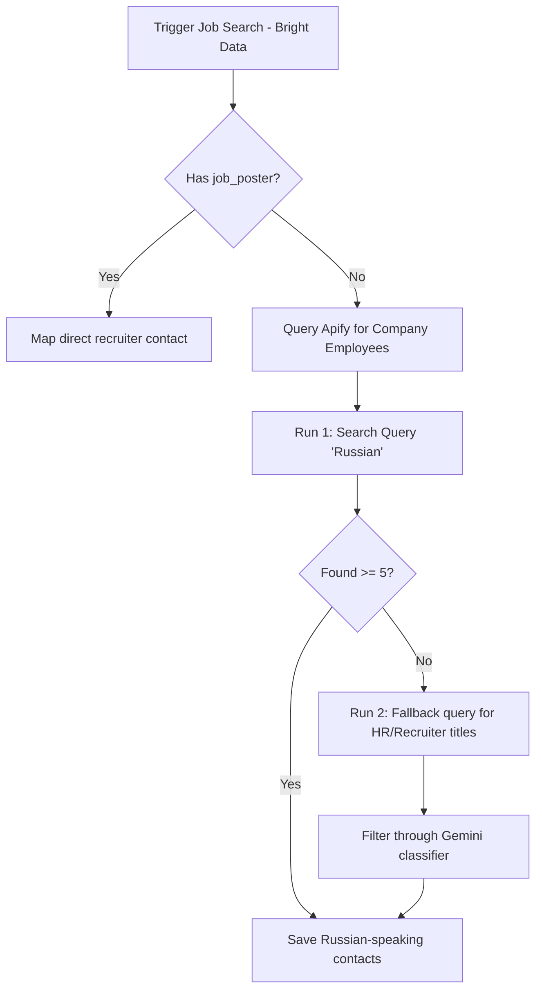

# 0002: Hybrid Scraping Architecture for Jobs and Outreach Contacts

## Status

Accepted

## Context

We require a reliable and automated way to search LinkedIn job listings and identify B2B outreach contacts (recruiters and hiring managers) for target companies. The initial implementation relied on local MCP servers (`jobspy-mcp-server` and `linkedin-scraper-mcp`), which required active user sessions and cookies. This exposed the candidate's personal LinkedIn account to rate-limiting, CAPTCHA blocks, or account suspension.

To solve this, we migrated to third-party web scraping APIs. We configured **Bright Data's** Job Listings Scraper (`gd_lpfll7v5hcqtkxl6l`), which successfully executes asynchronous searches and retrieves job postings. Crucially, approximately 11% of these listings include a `job_poster` contact record, identifying the exact recruiter who posted the job.

However, for the remaining 89% of jobs, the poster is anonymous. We attempted to use Bright Data's Company Info scraper (`gd_l1vikfnt1wgvvqz95w`) to retrieve employee contacts, but encountered two major blockers:
1. It only returns a tiny, fixed subset of employees (typically 6).
2. It does not scrape employee job headlines/titles (the `"title"` field in the returned dataset represents the employee's name, not their job role).

Thus, we need an alternative scraping capability to fetch company employees with their job titles and locations to identify Russian-speaking recruiters.

## Decision

We decide to implement a **hybrid scraping architecture** combining Bright Data and Apify services. We will configure the scraping pipeline as follows:

1. **Job Sourcing**: Bright Data's Web Scraper API (`gd_lpfll7v5hcqtkxl6l`) remains our primary scraper for job search runs.
2. **Direct Poster Mapping**: If a job listing contains a non-null `job_poster` object, we map this contact directly as the target recruiter.
3. **Fallback Employee Sourcing**: If the job poster is null, we invoke **Apify's** LinkedIn Company Employees Scraper (`harvestapi/linkedin-company-employees`) using a two-stage fallback query:
   * **Stage 1**: Query Apify for the target company's employees filtering by the keyword `"Russian"` (regardless of position).
   * **Stage 2 (Fallback)**: If Stage 1 returns fewer than 5 profiles, trigger a fallback query to Apify filtering for HR/Recruiting job titles (`jobTitles: ["Recruiter", "Hiring Manager", "HR", "Talent Acquisition", "Human Resources"]`). We then process this fallback list through our backend Gemini LLM classifier to determine who is likely a Russian speaker (evaluating names, headlines, summaries, and locations).
4. **Outreach Generator Language**: The LLM outreach generator will draft B2B messages in English. If the target contact is identified as a Russian speaker, it will automatically prepend a short, polite greeting in Russian before the core message text.
5. **Developer Mocking**: We will expand the `.env` `MOCK_SCRAPER=true` flag to mock both the Bright Data and Apify API handlers, yielding structured static mock responses offline during testing.

## Consequences

* **Multi-API Dependency**: The system now requires credentials for both Bright Data (`BRIGHTDATA_API_KEY`) and Apify (`APIFY_API_KEY`).
* **Enhanced Safety**: Running scraping tasks on commercial clouds prevents any direct scraping actions from the user's IP or logged-in LinkedIn session, ensuring account protection.
* **Credit Cost Efficiency**: Sourcing only a small batch of target employees (e.g. 20–30) per company run preserves Apify credit usage.
* **High Relevance**: The two-stage fallback gives us the best chance to target Russian-speaking recruiters, while falling back gracefully to general HR professionals if none are found.

---

## Historical note (environment variables)

This ADR uses `APIFY_API_KEY` in the consequences above. The current Apify credential name in `.env.example` is **`APIFY_API_TOKEN`**. Decision text is unchanged; use `.env.example` as the source of truth for setup.
