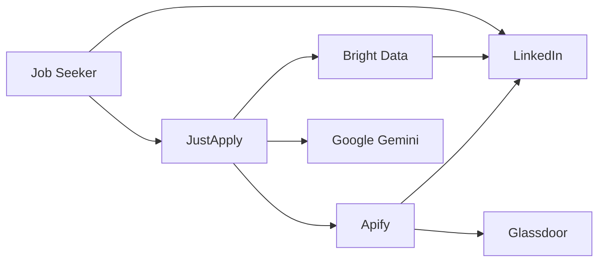
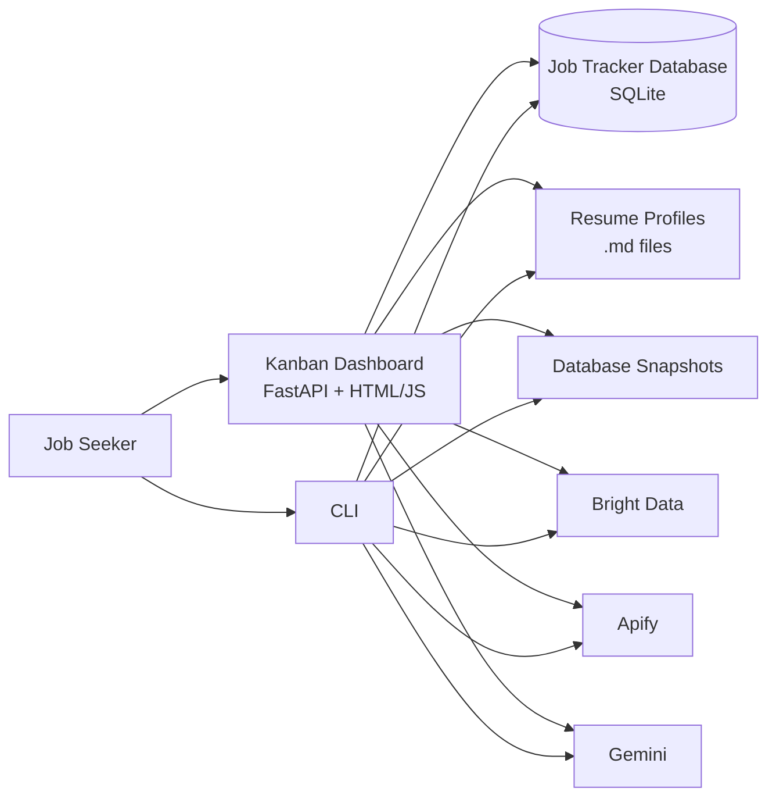
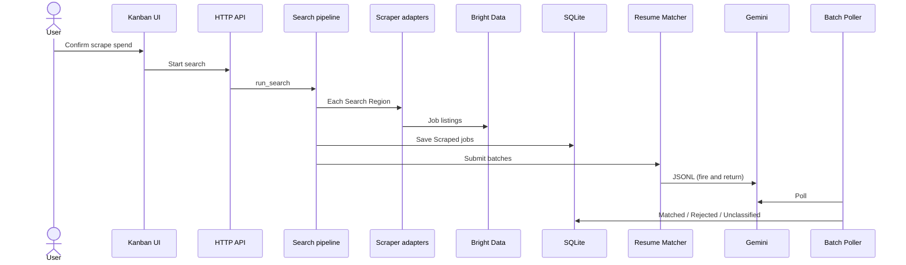

# JustApply architecture (Structurizr)

C4 model for this repo. Source of truth: [`workspace.dsl`](workspace.dsl). Domain terms match [`CONTEXT.md`](../../CONTEXT.md).

## Views

| Key | What it shows |
| --- | --- |
| SystemContext | Job Seeker, JustApply, Bright Data, Apify, Gemini, LinkedIn, Glassdoor |
| Containers | Kanban Dashboard, CLI, Job Tracker Database, Resume Profiles, snapshots |
| DashboardComponents | FastAPI, Batch Poller, pipelines, Resume Matcher, scrapers |
| SearchAndEvaluation | Scrape → Scraped lane → Gemini Batch → Matched/Rejected |
| EnrichmentFlow | Accepted Job → Contact Sample → templates |

## System context



JustApply runs on the Job Seeker's machine. Vendors scrape LinkedIn and Glassdoor. Gemini scores jobs and drafts outreach. The user still applies on LinkedIn.

## Containers



Two entry points share one database. The dashboard hosts the Batch Poller. The CLI can `--collect` the same batches.

## Search and evaluation



## View locally (free)

Do **not** run this from your home folder (`~`). `$(pwd)` must be the **JustApply repo root**, so Docker mounts this folder (the one with `workspace.dsl`).

Lite is frozen. Use the free `local` command instead. Docker Desktop must be running. Leave the terminal open — if you get a shell prompt back, the server stopped.

```bash
cd /path/to/JustApply

docker pull structurizr/structurizr
docker run -it --rm -p 8080:8080 \
  -v "$(pwd)/docs/architecture:/usr/local/structurizr" \
  -v "$(pwd)/docs/adr:/usr/local/structurizr/adr" \
  structurizr/structurizr local
```

Wait until logs show the server is listening. Then open **http://127.0.0.1:8080** (localhost only; other URLs are blocked).

If the data directory is not writable (common with the hardened image), add `--user "$(id -u):$(id -g)"` to `docker run`, or use the `noble` tag:

```bash
docker run -it --rm -p 8080:8080 \
  -v "$(pwd)/docs/architecture:/usr/local/structurizr" \
  structurizr/structurizr:latest-noble local
```

If you already ran the old command from `~`, Docker may have created an empty `~/docs/architecture`. That folder is not this repo; you can delete it.

The viewer may write `workspace.json` next to the DSL. That file is generated; do not edit it by hand.
